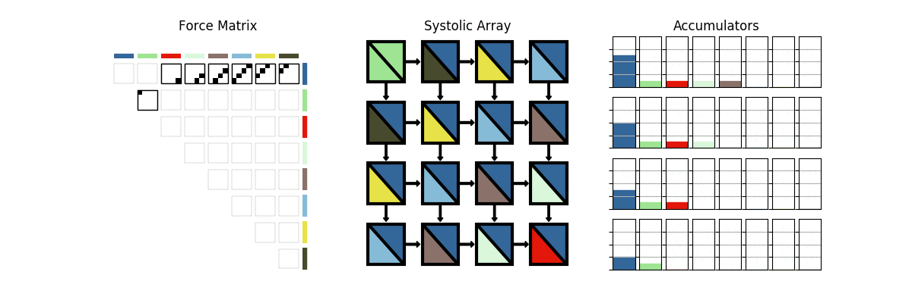

# Systolic Diagram Generation

Some Python scripts to do high level simulations of the n-body systolic system and generate animations. The systolic simulator should be working with any number of particles and systolic array width, however the plotter only works for N=4, n=32 as of now.

### Usage


```
python3 main_single.py
python3 main_double.py
```

### Results

#### Single Systolic Array

This is a system with 32 particles and a 4 x 4 systolic array. The force matrix shows which of the interactions are currently being calculated within the systolic array. The accumulators show the partial sums for each particle - as we the complete force on a particle before the integration occurs.




#### Double Systolic Array

This is the same system, but now with 2 systolic arrays working on the same force matrix - one shown in black and the other in red. In this system we do have to stall once - as seen in the white squares moving through the arrays. However, it does calculate it nearly twice as fast!


I actually think it might be possible to remove this stalling cycle but offsetting the two arrays by one - starting the second array 1 cycle after the first one. It works on the simulation, but I guess that might not be the most rigorous way of verifying it. 
